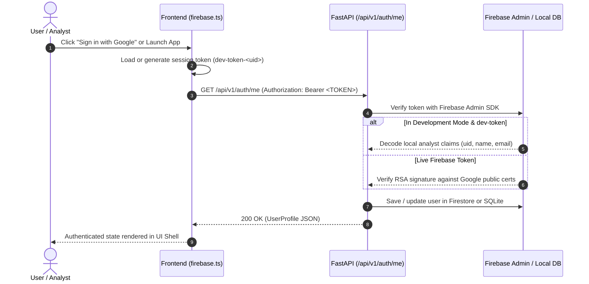
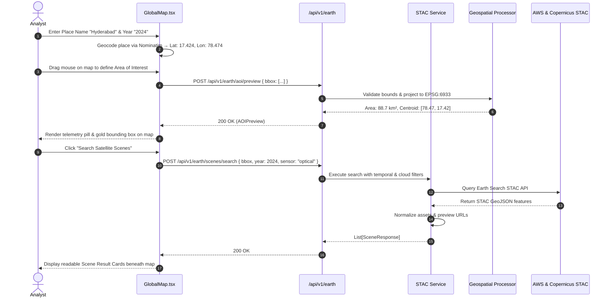
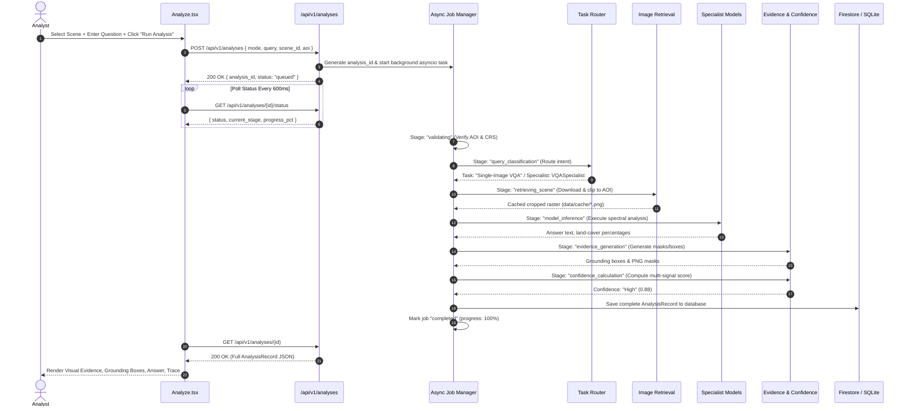
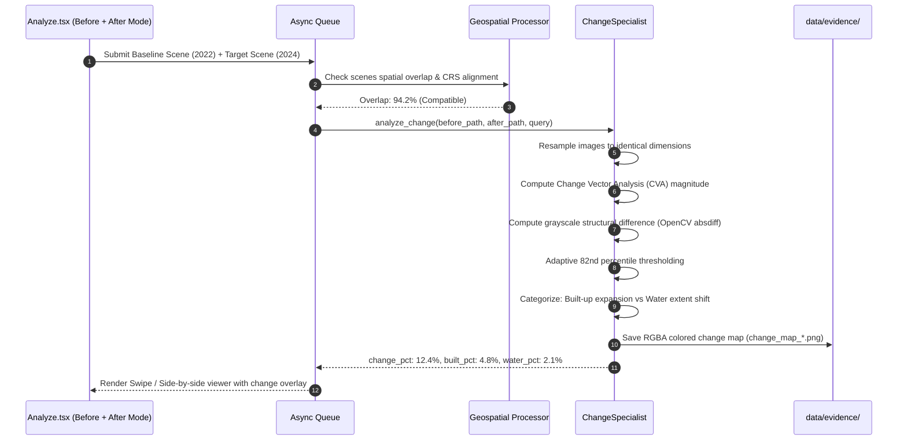
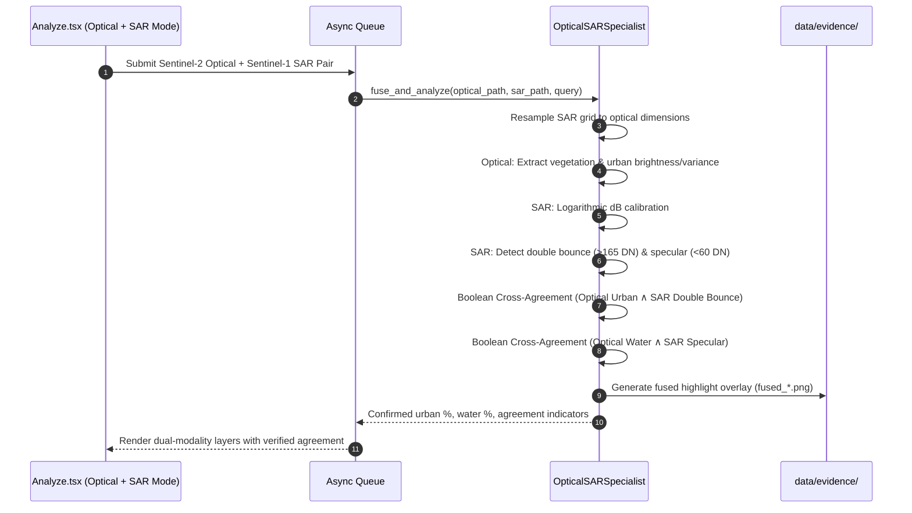
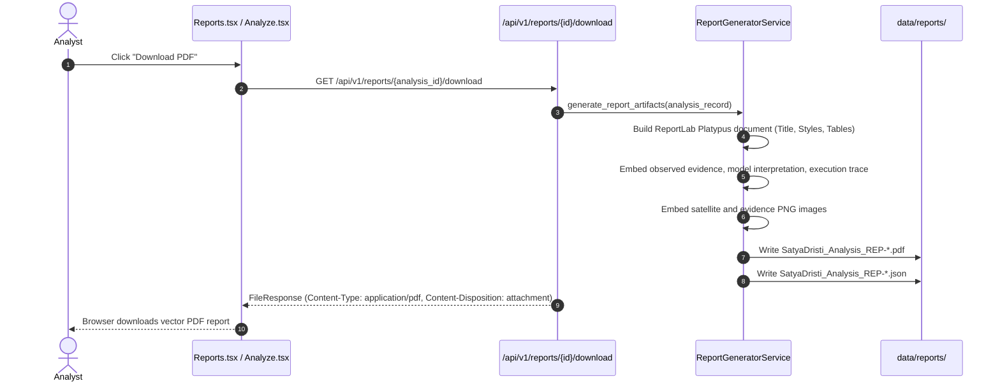
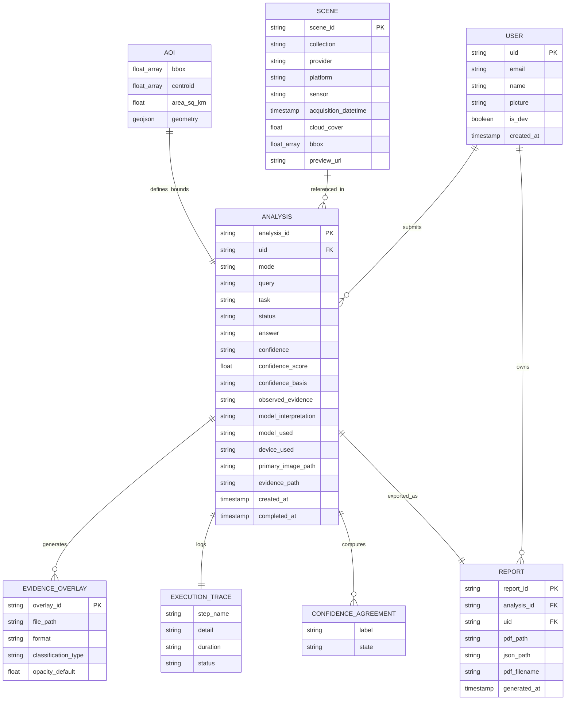
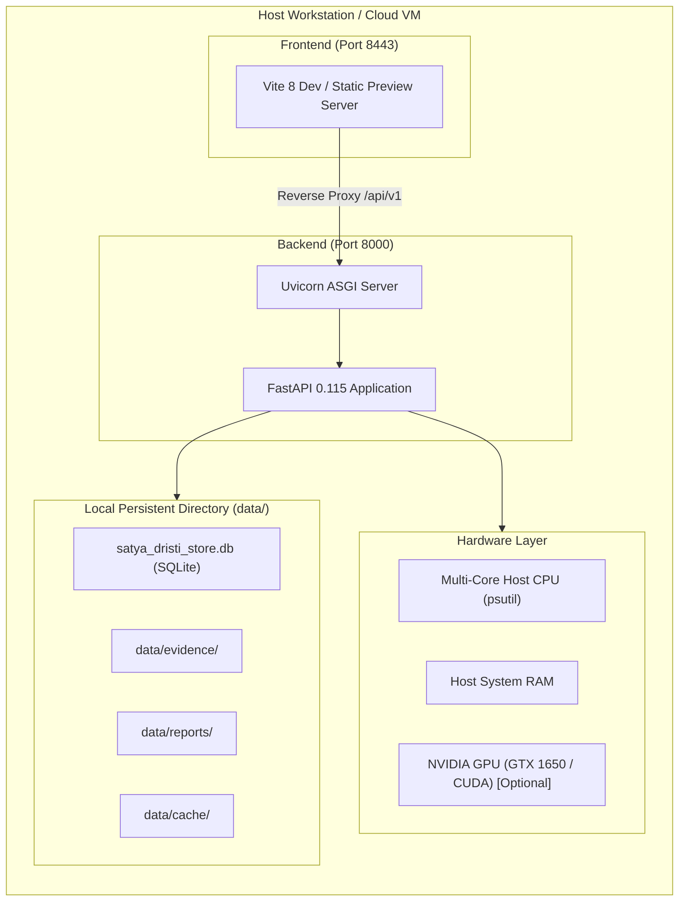

# Satya Dristi · System Architecture Document

**System Name**: Satya Dristi  
**Descriptor**: Multimodal Earth Observation Intelligence  
**Architecture Classification**: Client-Server Geospatial Intelligence Platform (SPA + Asynchronous REST Backend)  
**Target Operating Environment**: Local Dev / On-Premise GPU Workstation / Cloud VM (Docker-Ready)

---

## 1. System Overview

Satya Dristi integrates public satellite Earth observation data streams (Sentinel-2 MSI Optical and Sentinel-1 SAR GRD) with remote-sensing analysis engines, multi-layer visual evidence rendering, and auditable publication reporting.

```mermaid
graph TB
    subgraph Client ["Frontend Single Page App (React 19 + Vite + Leaflet)"]
        UI[User Interface · Shell & Pages]
        Map[Global Earth Observation Explorer]
        Controls[Left Control Panel · Modes & Queries]
        EvidenceView[Visual Evidence Canvas & Overlays]
        TraceView[Observable Execution Trace & Pipeline]
    end

    subgraph API ["FastAPI Service Layer (Python 3.11)"]
        RouterAuth["/api/v1/auth"]
        RouterEarth["/api/v1/earth"]
        RouterAnalyses["/api/v1/analyses"]
        RouterHistory["/api/v1/history"]
        RouterReports["/api/v1/reports"]
        RouterSystem["/api/v1/system"]
        AsyncQueue[Asynchronous Job Manager]
    end

    subgraph Geo ["Geospatial & Ingestion Infrastructure"]
        STACService[STAC Service Client]
        GeoProcessor[Shapely / PyProj Engine]
        ImageRetrieval[Image Retrieval & AOI Clipper]
    end

    subgraph AI ["Specialist Model & Inference Registry"]
        TaskRouter[Deterministic Intent Router]
        VQASpec[VQA Specialist · Spectral Decomp]
        GroundSpec[Grounding Specialist · Contour Localization]
        ChangeSpec[Change Specialist · CVA & Structural]
        FusionSpec[Optical-SAR Specialist · Radiometric Fusion]
        ConfEngine[Confidence Engine]
        ResManager[Hardware Resource Manager · PyTorch CUDA]
    end

    subgraph Storage ["Persistence & Storage Layer"]
        Firestore[Google Cloud Firestore / SQLite Local Store]
        ReportLab[ReportLab PDF Engine]
        DiskEvidence["data/evidence/*.png"]
        DiskReports["data/reports/*.pdf, *.json"]
        DiskCache["data/cache/*"]
    end

    subgraph Providers ["External Data Providers"]
        AWSEarth[AWS Earth Search STAC]
        Copernicus[Copernicus Data Space STAC]
        Esri[Esri World Imagery Basemap]
        OSM[OpenStreetMap Nominatim]
    end

    UI --> RouterAuth
    UI --> RouterEarth
    UI --> RouterAnalyses
    UI --> RouterHistory
    UI --> RouterReports
    UI --> RouterSystem

    RouterEarth --> STACService
    RouterEarth --> GeoProcessor
    STACService --> AWSEarth
    STACService --> Copernicus
    Map --> Esri
    Map --> OSM

    RouterAnalyses --> AsyncQueue
    AsyncQueue --> TaskRouter
    AsyncQueue --> ImageRetrieval
    ImageRetrieval --> DiskCache

    TaskRouter --> VQASpec
    TaskRouter --> GroundSpec
    TaskRouter --> ChangeSpec
    TaskRouter --> FusionSpec

    VQASpec --> ConfEngine
    GroundSpec --> ConfEngine
    ChangeSpec --> ConfEngine
    FusionSpec --> ConfEngine

    AsyncQueue --> DiskEvidence
    AsyncQueue --> Firestore
    RouterReports --> ReportLab
    ReportLab --> DiskReports
    Firestore -.-> RouterHistory
```

---

## 2. Component Architecture

### 2.1 Frontend Subsystem (`src/`)
* **Technology**: React 19, TypeScript 5.7, Vite 8, Tailwind CSS v4, Leaflet 1.9.4.
* **Component Hierarchy**:
  - `src/App.tsx`: Global route router and theme provider wrapper.
  - `src/components/Shell.tsx`: Navigation sidebar, header with live hardware telemetry pill, and user profile badge.
  - `src/pages/Analyze.tsx`: Core analytical workspace using a disciplined 3-column desktop layout:
    - **Left Column (~300px)**: Control panel (Input source, Analysis mode, Selected scene compact card, Question textarea, Example chips, Run Analysis primary action).
    - **Center Column (~700–800px)**: Global Earth Observation Explorer (Map context bar, 2-row uncramped search/filters, 460px Leaflet satellite map, GIS toolbar, available scene result cards *below* the map; transitions to Visual Evidence Viewer and Answer Panel upon completion).
    - **Right Column (~280px)**: Supporting Analysis Pipeline (compact 18px numbered circles, confidence rating, collapsible execution trace, and official PDF report download).
  - `src/components/GlobalMap.tsx`: Interactive Leaflet map, geocoding search, year/cloud filters, AOI drag-to-draw rectangle, and STAC scene catalogue renderer.
  - `src/components/SatImage.tsx`: High-resolution canvas rendering with interactive layer toggles (Optical, SAR, Change detection, Grounding bounding boxes, Grid reference), opacity controls, and temporal swipe/side-by-side comparison.
  - `src/components/Uploader.tsx`: Drag-and-drop file uploader for manual satellite imagery (GeoTIFF/PNG/JPEG).
  - `src/lib/api.ts`: Centralized HTTP client communicating with `/api/v1` endpoints with bearer token injection and error handling.
  - `src/lib/firebase.ts`: Authentication service managing analyst session, Google Sign-In state, and local storage tokens.

### 2.2 Backend Subsystem (`backend/app/`)
* **Technology**: FastAPI 0.115, Uvicorn, Pydantic 2.8, Python 3.11.
* **Service Layer**:
  - `stac_service.py`: Queries AWS Earth Search and Copernicus Data Space STAC APIs. Normalizes raw features into consistent `SceneResponse` schemas with verified preview URLs.
  - `geospatial_processor.py`: Uses Shapely and PyProj to validate geometries, compute geodesic areas in EPSG:6933, verify scene footprint overlaps, and evaluate cross-scene spatial compatibility.
  - `image_retrieval.py`: Downloads preview imagery, clips raster arrays to exact AOI coordinates using normalized bbox ratios, applies radar logarithmic dB transforms for SAR, and caches assets locally.
  - `async_queue.py`: Background task executor managing analysis job states (`queued` → `validating` → `query_classification` → `retrieving_scene` → `model_inference` → `evidence_generation` → `confidence_calculation` → `report_generation` → `completed`), capturing observable step timings in execution traces.
  - `report_generator.py`: ReportLab Platypus engine generating vector PDF reports and structured JSON exports embedding scene coordinates, spectral findings, and satellite imagery.
  - `db.py`: Dual-mode storage engine connecting to Google Cloud Firestore or falling back to a thread-safe SQLite document database (`data/satya_dristi_store.db`).
  - `firebase.py`: Verifies Firebase JWT ID tokens via `firebase-admin` or decodes developer session tokens in development mode.

---

## 3. Comprehensive Sequence Flows

### 3.1 Authentication Flow

---

### 3.2 Satellite Discovery & AOI Flow

---

### 3.3 Analysis Execution Flow

---

### 3.4 Bi-Temporal Change Detection Flow

---

### 3.5 Optical + SAR Cross-Modal Fusion Flow

---

### 3.6 Report Generation & Download Flow

---

## 4. Data Schema & Entity Relationships

The data model is structured around users, remote-sensing observations, analysis jobs, visual evidence, and generated reports:

---

## 5. Security Architecture

### 5.1 Authentication and Identity Verification
* **Production**: The application verifies cryptographically signed JWT ID tokens issued by Firebase Authentication using the Google public keys through `firebase_admin.auth.verify_id_token`.
* **Development Isolation**: When `ENVIRONMENT="development"`, local development tokens (`dev-token-<uid>`) bypass RSA signature checks to allow offline developer testing and evaluation without active GCP credentials.
* **User Data Scoping**: All database queries for analyses and reports filter on the verified `uid`, preventing unauthorized cross-user data access.

### 5.2 File and Upload Security
* **Filename Sanitization**: Uploaded files are cleaned using `pathlib.Path(filename).name` to prevent directory traversal (`../`) attacks.
* **Size Limits**: Form data uploads enforce a 100MB ceiling.
* **Storage Segregation**: User uploads are segregated in `data/uploads/`, system cache in `data/cache/`, generated evidence in `data/evidence/`, and reports in `data/reports/`.
* **GeoJSON Bounds Checks**: All user AOI inputs are strictly validated against WGS84 range limits ($[-180, 180]$ longitude, $[-90, 90]$ latitude).

---

## 6. Deployment & Hardware Execution

* **Frontend Port**: `8443` (Vite dev server with `/api/v1` and `/static` reverse proxy).
* **Backend Port**: `8000` (Uvicorn ASGI server).
* **Hardware Adaptation**: Automatically detects NVIDIA CUDA via PyTorch. If CUDA VRAM is $\ge 600\text{MB}$, operations are hardware-accelerated on `cuda:0`; otherwise, operations execute on CPU without throwing errors.
